### **SpringFramework/Mybatis/Oracle 기반 웹사이트 제작**

------

#### **프로젝트 설명**

Spring Framework(Maven), Mybatis Framework, Oracle 기반으로 구현한 원페이지(pageless) 기업 소개 및 채용 사이트 입니다.

 

 

### **시작하기(Getting Started)**

------

#### **1. 개발환경 구축**

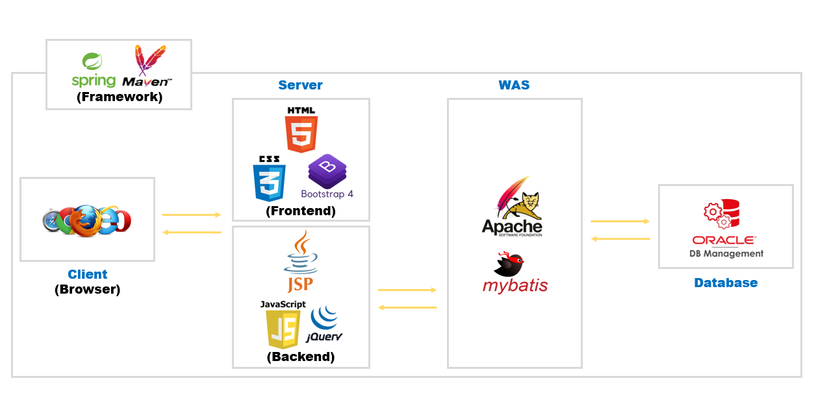

 

(1) 개발자도구: Spring Tool Suite(sts-3.9.12.RELEASE), SQLDeveloper

(2) 웹브라우저(Debug): Chrome

(3) 웹서버(Frontend): HTML5, CSS3, Bootstrap4

(4) 웹서버(Backend): JSP(Java Servlet Page), Javascript(jQuery)

(5) 웹 어플리케이션 서버: apache-tomcat-8.5.53(8.5v)

(6) 데이터베이스(DB): OracleXE112_Win64

(7) 프레임워크: Spring(Web), mybatis(DB)

 

#### 2. Spring Libraries(TeamProject\pom.xml 참고)

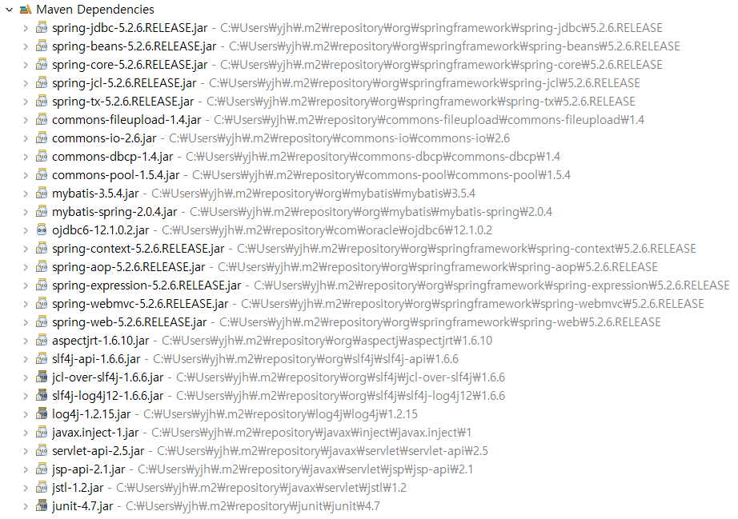

 

 

### **개발하기**

------

#### **1. 데이터베이스(TeamProject\src\main\webapp\resources\SQL 내 파일 참고)**

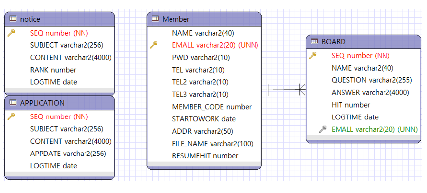

 

(1) Notice(공지사항 DB)

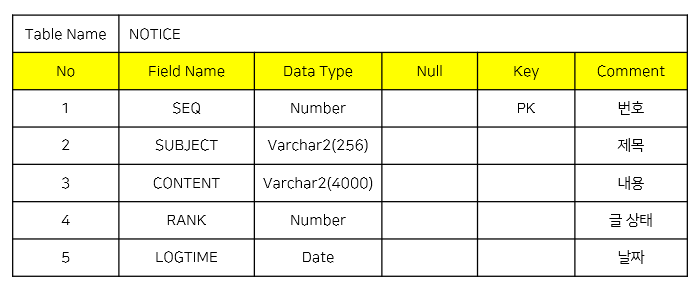

 

(2) Application(입사지원 DB)

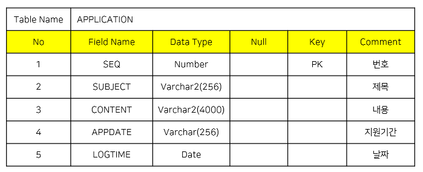

 

(3) Member(전체 회원 DB)

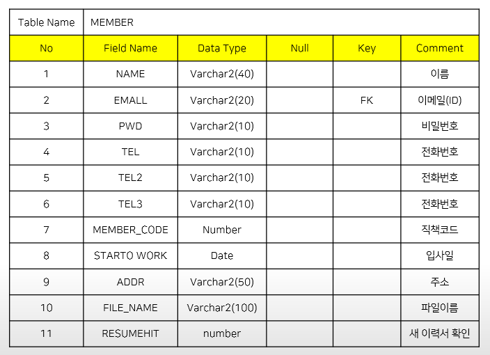

 

(4) Board(Q&A/문의하기 DB)

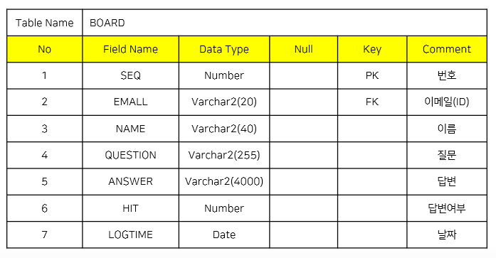

 

 

#### **2. 사이트 구조도**

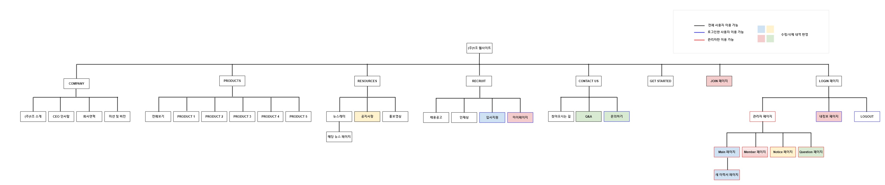

 

 

#### **3. 파일 상세 설명**

(1) JAVA 파일(TeamProject\src\main\java 내 파일 참고)

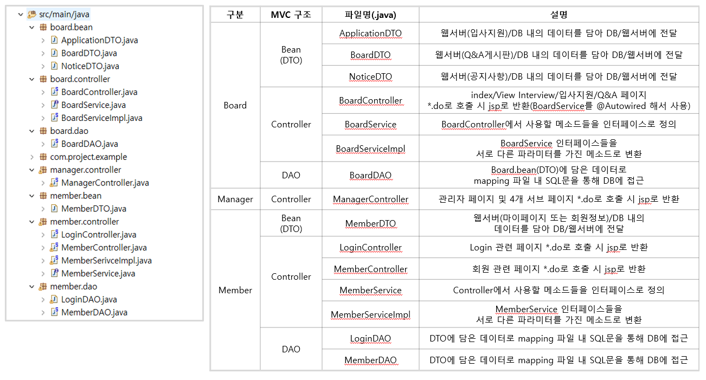

 

(2) JSP 파일-1(TeamProject\src\main\webapp\WEB-INF 내 파일 참고)

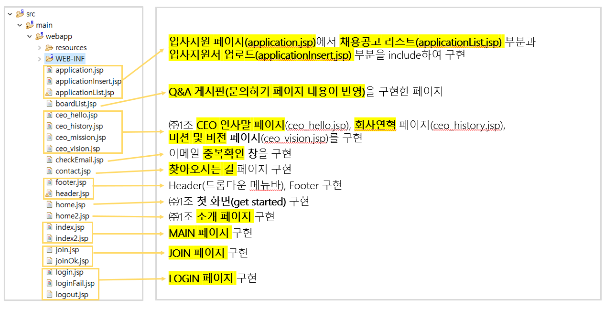

 

(3) JSP 파일-2(TeamProject\src\main\webapp\WEB-INF 내 파일 참고)

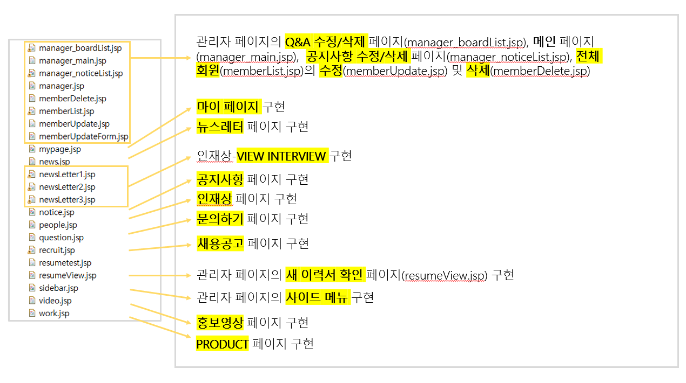

 

(4) 기타 파일

▶ **TeamProject\src\main\webapp\WEB-INF\web.xml**:

=> servlet-context.xml와 root-context.xml을 사용해서 웹 전체 흐름을 제어할 것을 정의

 

▶ **TeamProject\src\main\webapp\WEB-INF\spring\appServlet\servlet-context.xml**:

=> MVC Controller와 관련된 설정

 

▶ **TeamProject\src\main\webapp\WEB-INF\spring\root-context.xml**:

=> 웹 전체에서 사용하는 DataSource(DB접속정보), mybatis 연동 설정

 

▶ TeamProject\src\main\resources\mybatis 내 파일:

=> **db.properties**: root-context.xml에서 정의한 내용을 통해 DB 접속정보 설정

=> **mybatis-config.xml**: DB에 데이터를 전달할 DTO 클래스와 SQL문을 구동시킬 mapping 파일을 정의

=> **OOO-mapping.xml**: mybatis framework를 사용해 구동시킬 SQL문을 정의

 

▶ **Servers\Tomcat v8.5 Server at localhost-config\web.xml & server.xml**:

=> 해당 프로젝트를 서버에서 구동 시 처음으로 나타날 페이지를 지정(현재 index2.jsp)

 

 

#### **4. 구현 화면**

(1) 사이트 MAIN 페이지(index)

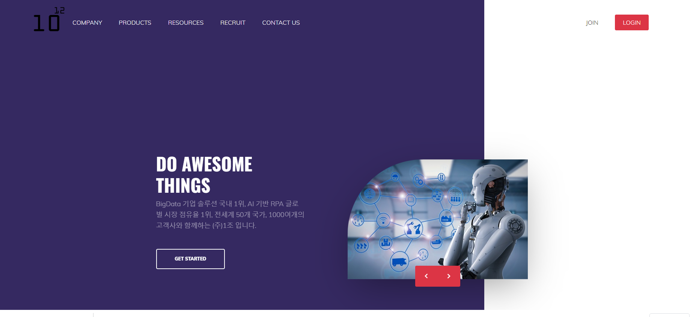

 

(2) LOGIN 페이지

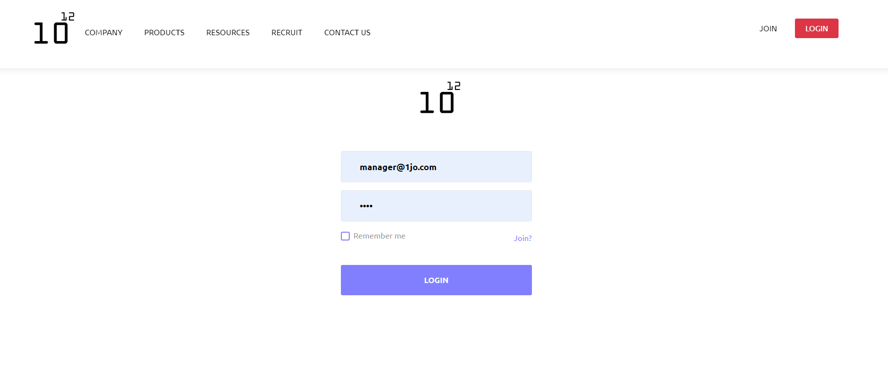

 

(3) 관리자 페이지

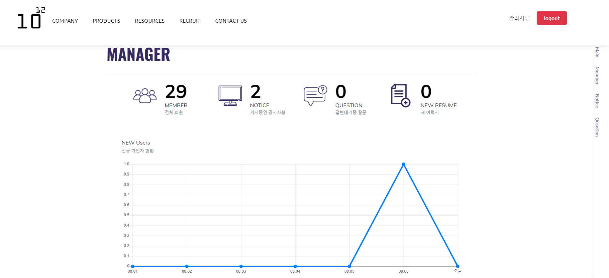

▶ 사이드 메뉴 및 아이콘 클릭을 통해 해당 DB 수정/삭제 페이지로 이동하며 실시간으로 DB 내용이 업데이트 됩니다.

 

(4) 공지사항 페이지

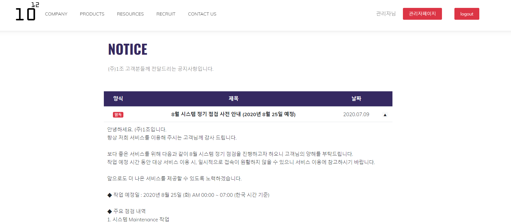

▶ 원페이지로 이동하며 관리자 페이지에서 작성한 공지사항이 업데이트 됩니다.

 

(5) 입사지원 페이지

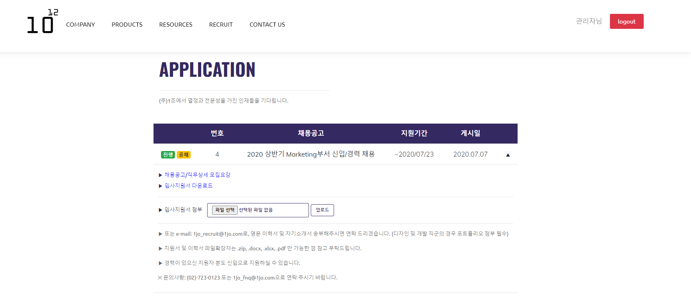

▶ 상세 모집요강 및 입사지원서 다운로드 후 파일을 업로드하면 해당 사용자 Mypage, 관리자 페이지에서 새 이력서를 확인할 수 있습니다.

 

(6) Q&A 페이지

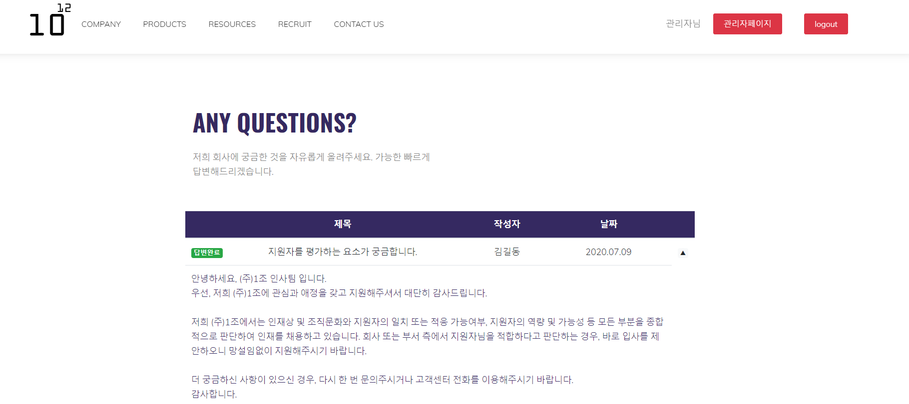

▶ CONTACT US 하단 메뉴 중 '문의하기' 페이지를 통해 문의한 내용이 실시간으로 업데이트 됩니다. 관리자 페이지에서 해당 문의사항에 대한 답변을 작성할 수 있습니다.

 